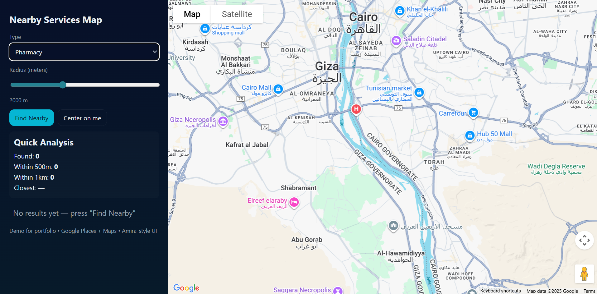

# Nearby Services Map


A React-based web application that helps users find nearby services such as pharmacies, ATMs, hospitals, restaurants, banks, and supermarkets using Google Maps and Places APIs. The project is built with **Vite** and features an interactive map and sidebar interface with quick analysis of nearby places.

---

## Features

* **Interactive Map**: Displays the user's location and nearby services.
* **Search Nearby**: Find services by type and radius.
* **Distance Calculation**: Uses Haversine formula to calculate distances to nearby places.
* **Quick Analysis**: Shows number of places within 500m and 1km, and closest place.
* **Responsive UI**: Sidebar with controls and results, map pane with markers.
* **Markers & Info**: Click markers to see details in the sidebar.

---

## Technologies Used

* **React 19**
* **Vite**
* **Google Maps JavaScript API**
* **Google Places API**
* **JavaScript (ES6)**
* **CSS / Responsive UI**

---

## Setup

1. **Clone the repository**

```bash
git clone https://github.com/amiraram23/nearby-services-map.git
cd nearby-services-map
```

2. **Install dependencies**

```bash
npm install
```

3. **Set up environment variables**
   Create a `.env` file in the root of the project:

```env
VITE_GOOGLE_MAPS_API_KEY=YOUR_API_KEY_HERE
```

Make sure your API key has **Maps JavaScript API** and **Places API** enabled and billing is activated.

4. **Run development server**

```bash
npm run dev
```

Open [http://localhost:5173](http://localhost:5173) in your browser.

---

## Build & Deploy

1. **Build the project**

```bash
npm run build
```

2. **Deploy to GitHub Pages**

```bash
npm run deploy
```

> Make sure the `deploy` script in `package.json` points to the correct build folder (`dist` for Vite):

```json
"deploy": "gh-pages -d dist"
```

3. **Access your deployed project**
   Visit: `https://amiraram23.github.io/nearby-services-map/`

---

## Usage

* Use the **Type** dropdown to select the kind of service.
* Adjust the **Radius** slider to change the search radius.
* Click **Find Nearby** to search for places around your location.
* Click on markers or results to see detailed info and focus the map.

---

## Notes

* Make sure browser geolocation is enabled.
* Ensure billing is enabled in your Google Cloud account for Maps and Places APIs.
* The app calculates distance using the Haversine formula.

---

## License

This project is free to use and modify.

---

*Demo created by Amira • Google Maps & Places Integration • React + Vite project*

If you are developing a production application, we recommend using TypeScript with type-aware lint rules enabled. Check out the [TS template](https://github.com/vitejs/vite/tree/main/packages/create-vite/template-react-ts) for information on how to integrate TypeScript and [`typescript-eslint`](https://typescript-eslint.io) in your project.
